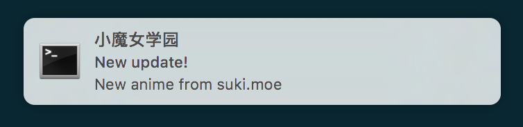

# suki.moe 定时检查脚本

## 安装

1. 安装 [terminal-notifier][terminal-notifier]：``brew install terminal-notifier``
2. 安装 Python requests 包：``pip install requests``
3. 下载源代码：``git clone https://github.com/kxxoling/suki_agent.git ~/``
4. 安装 plist：``ln -s ~/suki_agent/moe.suki.agent.plist  ~/Library/LaunchAgents/``
5. 将帐号密码设置在 launchd 的环境变量中：``launchctl setenv SUKI_USER your_username; launchctl setenv SUKI_PASSWORD your_password``

[terminal-notifier]: https://github.com/julienXX/terminal-notifier

## 效果图

